# Full Stack Application - Part B

[GitHub Link](https://github.com/habibah-adam/uyghur_school)
[AWS Link](http://18.132.120.125/)

*Feature Test Credentials*: 
- Teacher Account:
    - email: hebibe2s@gmail.com
    - password: 0Password1
- Parents Account:
    - Any newly created account is set as Parent
    - Only Teachers are configured as teacher account via backend in the database.
    - To Test parent account, please use *register* link to create an account and use that account to login and test.

## Introduction

As part of the term 4 assignment, this `README` file is produced to detail the project where it touches the points:
- Purpose of this project
- Key functionalities or features of the project
- Target audience of the website
- Technology stack used to build the website

As part of the supporting resources, this `README` file includes:
- Wireframes
- Dataflow Diagrams
- Architecture of the application
- User stories

### Purpose

There is a small community in Sydney, Uyghur community. This community has established a community language schools a decade ago to preserve the Uyghur language and taught Uyghur language to many Uyghur children every year. However, the school is lacking public face via its own website. Also the communication or publications are mainly done via popular messaging app, WhatsApp. This caused some loss of information in Parent-Teacher communication. To address this issue, this website will help the school to have a website to publish its activities and conduct formal Parent-Teach communications via this site. 

This website will also help teachers to post regular blogs to promote the school and log the weekly activities performed on the weekend. 

From time to time, school will be in need of language or admin staff. This website will also be posting available position to recruit new helpers.

### Functionalities - Features

#### Blogging
Teacher or even parents are strongly encouraged to post blogs regularly to inform the public about the school and its activities. The website will allow logged in users to post blogs and give teachers the ability to monitor the parent blogs and remove the unrelated, offensive blogs when found. Blogs can have photos of the children, classrooms and teachers.

#### Login and register
The website will allow users to register if they are not registered yet, and will send the new registration to a teacher to approve or reject. Once approved, an account will be created in the backend and registering user will receive an email notification with further details. 

Registered users can:
- login
- logout
- reset password
- update profiles
- request to close the account
    - Website Admin will then delete the account from the backend and destroy all user related data.

#### Children Enrollment
NSW government requires each student to be enrolled using the government provided enrollment form. Currently the app does not implement enrollment process in itself, however, the website will provide the functionality to download the (PDF) form and upload it to the system for teachers to download for further processing. Anyone can download, but only registered users can upload to the system.

#### Performance report
Teachers can give private student school reports to the parent account and only the parent account can see the report of the child assigned to the parent account.

### Target audience of the website
The audience of this website will be:
- General public
    - Anyone with Internet access can visit the website and obtain brief overview of the school.
    - Interested parents can register themselves
    - Contact details will be available for any sponsors or visitors
- Teachers
    - Probably the most important user of this site.
    - administer the school teaching procedures
    - communication hub
    - document exchange platform
- Parents
    - can register
    - login or logout
    - view child(ren) performance
    - teacher feedbacks
    - parent-teacher communications

### Technology stack

#### Backend programming
`Python` is the main programming language and `Flask` is the framework used to build the website. 
#### Frontend
`Jinja2` templating engine will be the main driver for generating frontend where it utilizes the `HTML` templates. `JavaScript` is not used due to the lack of expertise in this language and its ecosystems (`Reat`, `Vue`, `Angular`). `CSS` will be used for styling the website. 

#### Database
`PostgreSQL` will be used to support the backend data persistency. 
#### Deployment
`AWS` will be the cloud platform to deploy the app. Components in `AWS` will be:
- Two `EC2` instances with identical configuration to host the web application
- One `EC2` instance to host `PostgreSQL` database. 
- `S3` bucket for resource storages as well as for database backups.
- `ELB` will be used to load balance the webapps.
- `Git` for version control the code
- `GitHub` for hosting the `git` repository
- `GitHub Action` to implement `CI/CD` pipeline.
- *MAYBE* `Grafana` and `Prometheus/InfluxDB` to monitor the stack's performance.

### Wireframes

Become Teacher Desktop             | Become Teacher Mobile 
:-------------------------:|:-------------------------:
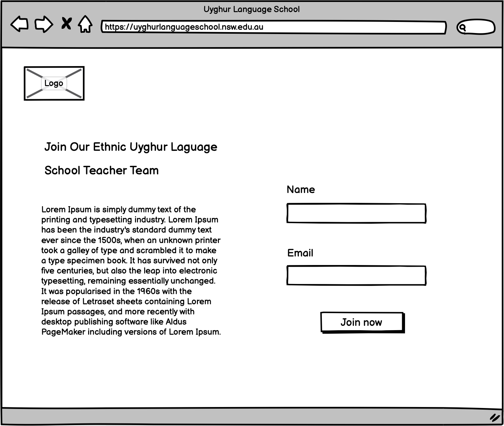  |  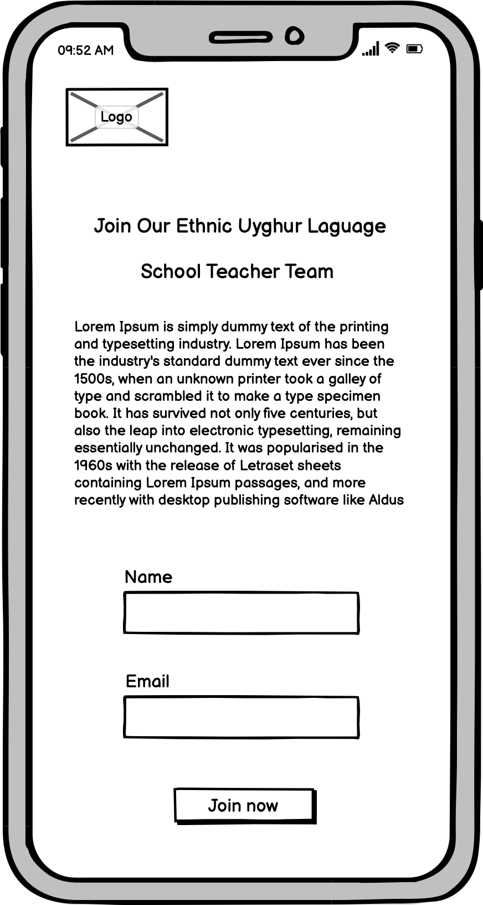 

Blog Desktop             | Blog Mobile 
:-------------------------:|:-------------------------:
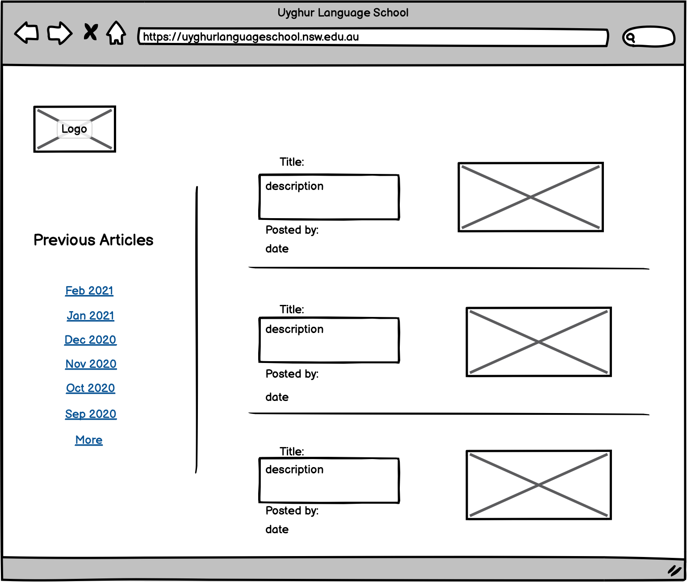  |  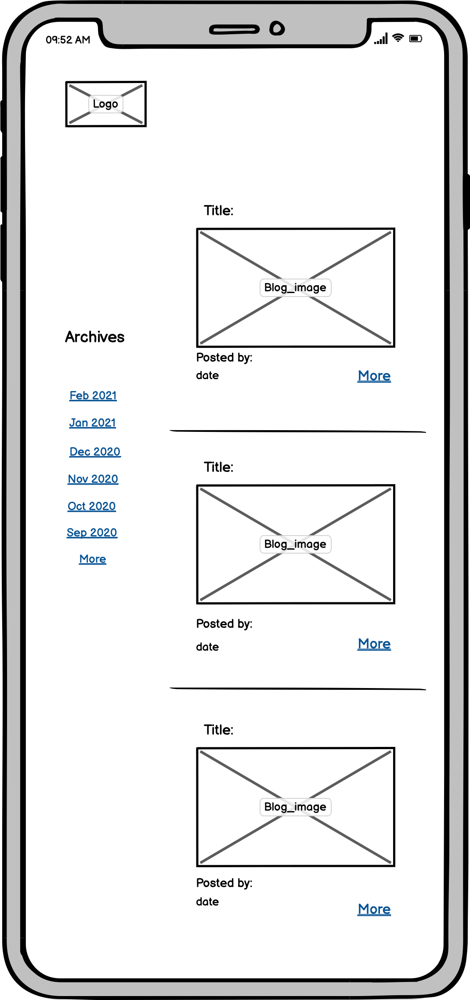 

Enrol Desktop             | Enrol Mobile 
:-------------------------:|:-------------------------:
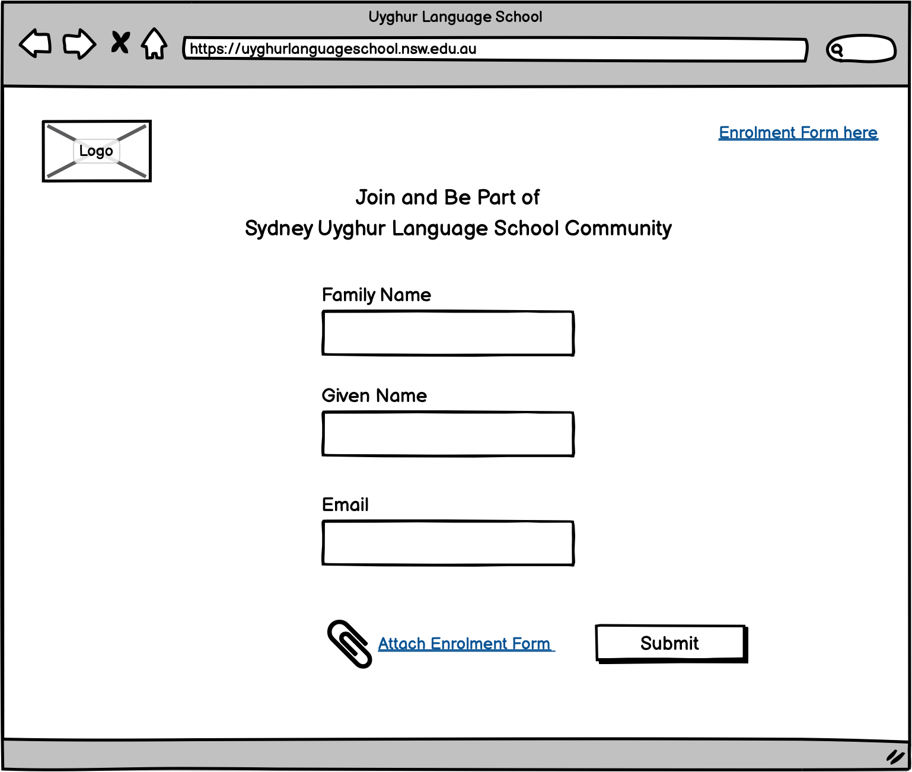  |  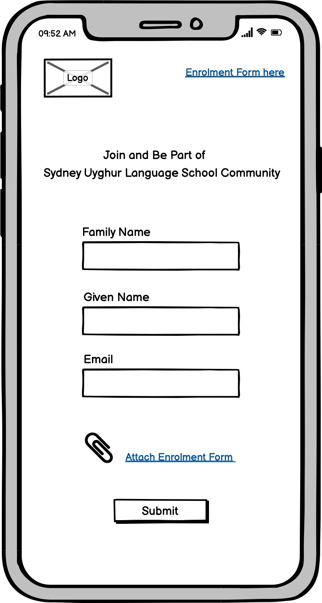 

Landing Desktop             | Landing Mobile 
:-------------------------:|:-------------------------:
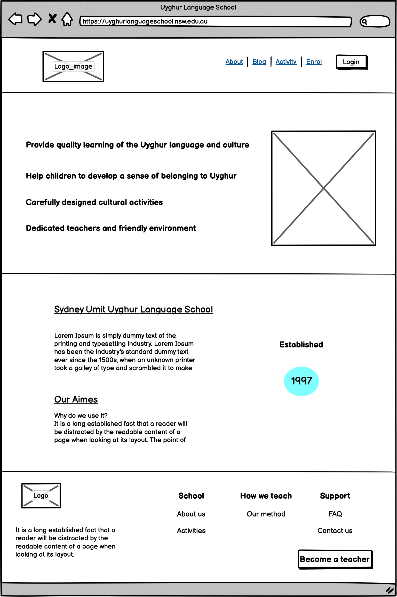  |  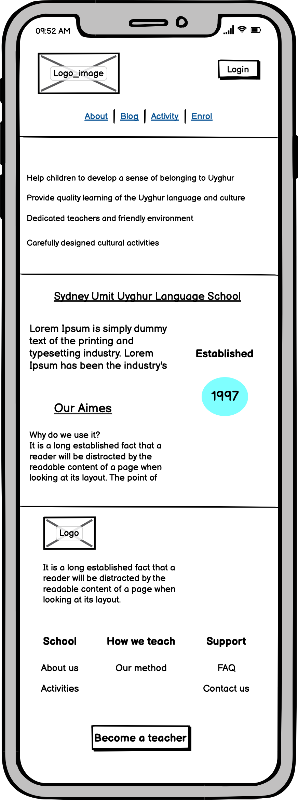 

Login Desktop             | Login Mobile 
:-------------------------:|:-------------------------:
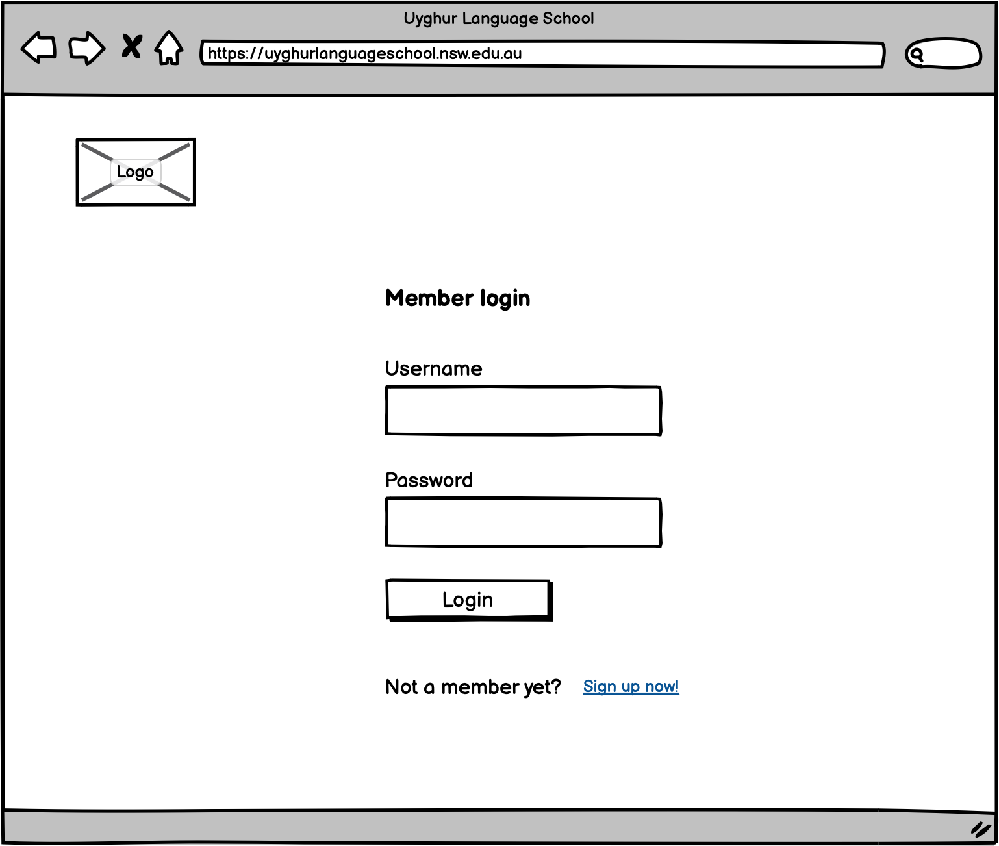  | 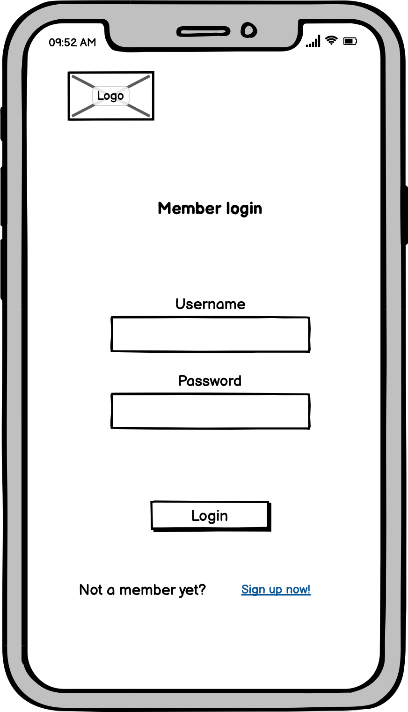 

Parent Account Desktop             | Parent Account Mobile 
:-------------------------:|:-------------------------:
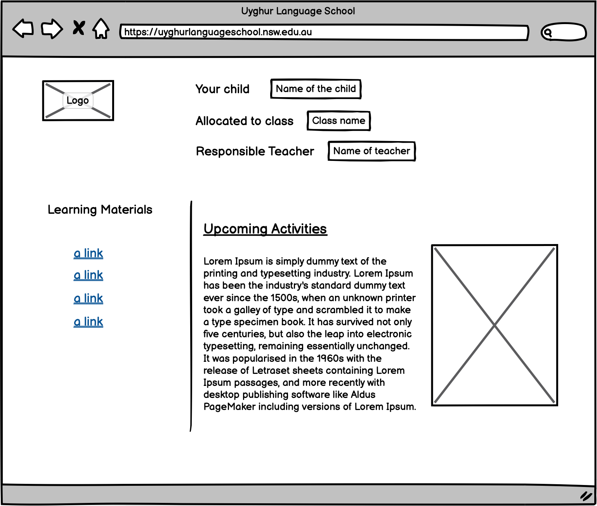  |  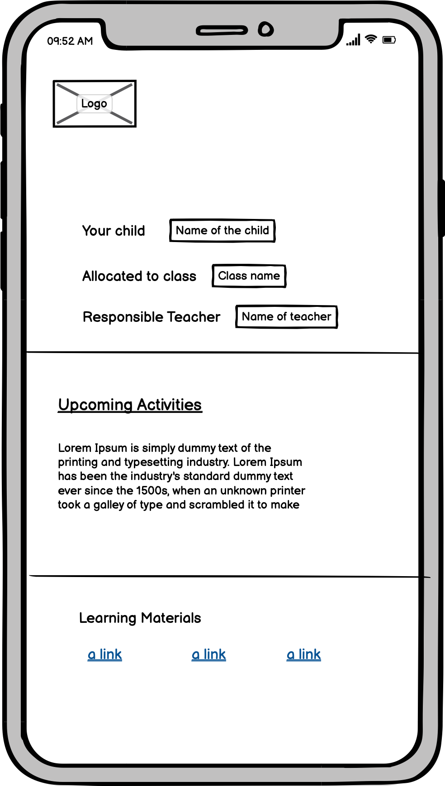 

### User Stories

`User story1`
> As a teacher I want to be able to login to the system

`Acceptance story`
> Login screen shows the login boxes with submit button, 
> After credentials are passed, I want to see me at the top right as logged in user
> If credentials are wrong, then error message to be shown
> Reset password, Forgot password functionality is expected.

`User story2`
> As a teacher I want to be able to blog

`Acceptance Story`
> Create Blog tab is expected for teacher users
> I can edit past blogs
> Blog creation/edit page is expected after going to blogging tab

### Architecture
The following architecture is designed and intended to be implemented in `AWS` cloud platform:
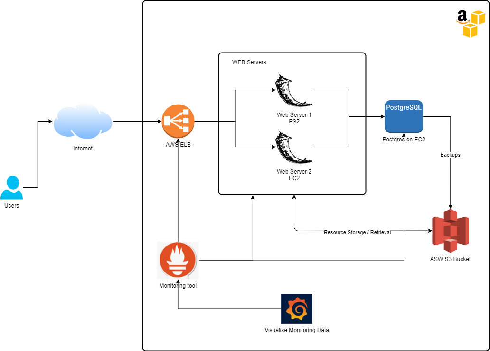

### Dataflow Diagrams

#### ERD Diagram
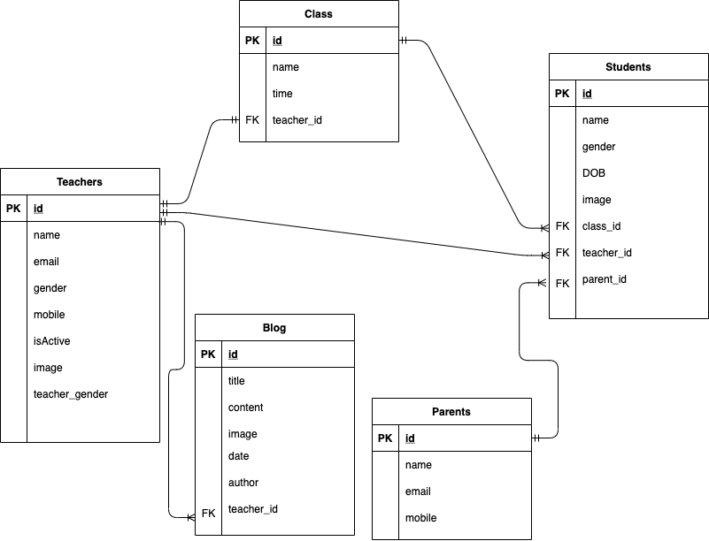

#### Flow Charts

##### Blog creation

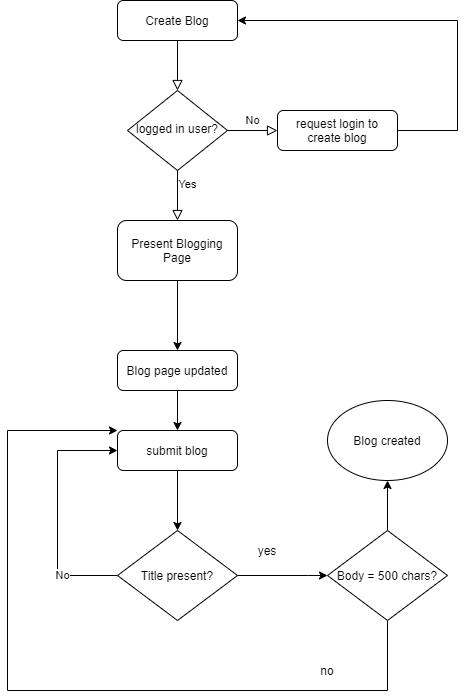

#### User Registration

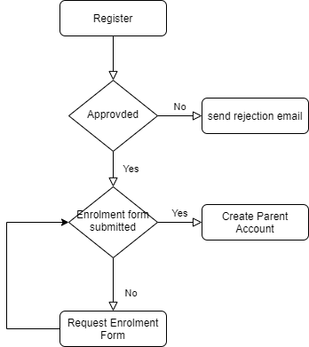